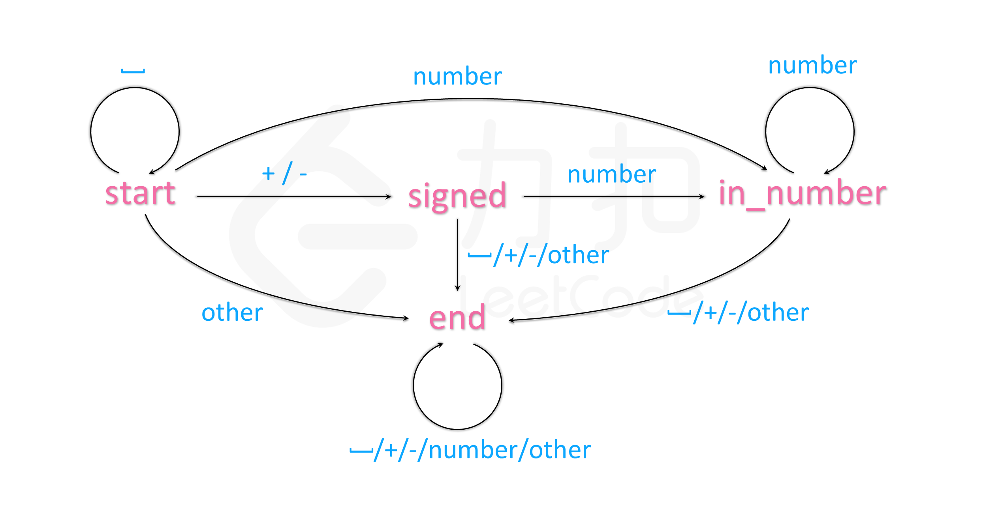

# 确定有限状态机（deterministic finite automaton, DFA）
## lc08
字符串处理的题目往往涉及复杂的流程以及条件情况，如果直接上手写程序，一不小心就会写出极其臃肿的代码。
因此，为了有条理地分析每个输入字符的处理方法，我们可以使用自动机这个概念：

我们的程序在每个时刻有一个状态 s，每次从序列中输入一个字符 c，并根据字符 c 转移到下一个状态 s'。这样，我们只需要建立一个覆盖所有情况的从 s 与 c 映射到 s' 的表格即可解决题目中的问题。
本题可以建立下图所示自动机：


|       | ‘’    | +/-   | number | other | 
| :---: | :---: | :---: |:---: |:---: |
| **start** | start | signed | in_number | end |
| **signed** | end | end | in_number | end |
| **in_number** | end | end | in_number | end |
| **end** | end | end | end | end |

接下来编程部分就非常简单了：我们只需要把上面这个状态转换表抄进代码即可。
另外自动机也需要记录当前已经输入的数字，只要在 s' 为 in_number 时，更新我们输入的数字，即可最终得到输入的数字。

```cpp
class Automation {
    string state = "start";
    unordered_map<string, vector<string>> table = {
        {"start", {"start", "signed", "in_number", "end"}},
        {"signed", {"end", "end", "in_number", "end"}},
        {"in_number", {"end", "end", "in_number", "end"}},
        {"end", {"end", "end", "end", "end"}}
    };
    int get_col(char c) {
        if(isspace(c)) return 0;
        if(c == '+' || c == '-') return 1;
        if(isdigit(c)) return 2;
        return 3;
    }
public: 
    int sign = 1;
    long long ans = 0;
    void get(char c) {
        state = table[state][get_col(c)];
        if(state == "in_number") {
            ans = 10 * ans + c - '0';
            ans = sign == 1 ? min(ans, (long long)INT_MAX) : min(ans, -(long long)INT_MIN);
        }
        else if(state == "signed") {
            sign = c == '+' ? 1 : -1; 
        }
    }
};
class Solution {
public: 
    int myAtoi(string s) {
        Automation automation;
        for(char c : s)
            automation.get(c);
        return automation.sign * automation.ans;
    }
};
```

一般long和int一样，都是4字节，且有符号，但leetcode上long和longlong一样为8字节
类型的大小与编译器相关，在使用时尽量用int 和 long long