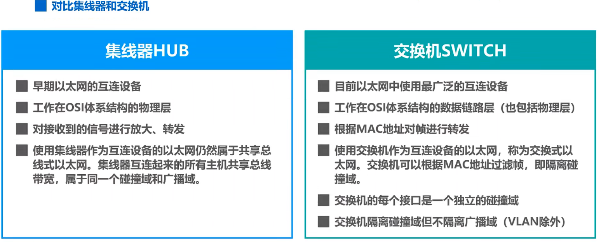

<!-- TOC -->

- [物理层](#%E7%89%A9%E7%90%86%E5%B1%82)
    - [1. 物理层下的传输媒体](#1-%E7%89%A9%E7%90%86%E5%B1%82%E4%B8%8B%E7%9A%84%E4%BC%A0%E8%BE%93%E5%AA%92%E4%BD%93)
    - [2. 传输方式](#2-%E4%BC%A0%E8%BE%93%E6%96%B9%E5%BC%8F)
    - [3. 编码与调制](#3-%E7%BC%96%E7%A0%81%E4%B8%8E%E8%B0%83%E5%88%B6)
    - [4. 信道极限准则则](#4-%E4%BF%A1%E9%81%93%E6%9E%81%E9%99%90%E5%87%86%E5%88%99%E5%88%99)
- [数据链路层层](#%E6%95%B0%E6%8D%AE%E9%93%BE%E8%B7%AF%E5%B1%82%E5%B1%82)
    - [1. 三个重要问题（点对点信道））](#1-%E4%B8%89%E4%B8%AA%E9%87%8D%E8%A6%81%E9%97%AE%E9%A2%98%E7%82%B9%E5%AF%B9%E7%82%B9%E4%BF%A1%E9%81%93)
        - [1.1. 封装成帧帧](#11-%E5%B0%81%E8%A3%85%E6%88%90%E5%B8%A7%E5%B8%A7)
        - [1.2. 差错检测测](#12-%E5%B7%AE%E9%94%99%E6%A3%80%E6%B5%8B%E6%B5%8B)
        - [1.3. 可靠传输](#13-%E5%8F%AF%E9%9D%A0%E4%BC%A0%E8%BE%93)
            - [1.3.1. 三种方式（协议）](#131-%E4%B8%89%E7%A7%8D%E6%96%B9%E5%BC%8F%E5%8D%8F%E8%AE%AE)
    - [2. 点对点协议PPP](#2-%E7%82%B9%E5%AF%B9%E7%82%B9%E5%8D%8F%E8%AE%AEppp)
    - [3. MAC地址、IP地址以及ARP协议](#3-mac%E5%9C%B0%E5%9D%80ip%E5%9C%B0%E5%9D%80%E4%BB%A5%E5%8F%8Aarp%E5%8D%8F%E8%AE%AE)
    - [4. 集线器、交换机](#4-%E9%9B%86%E7%BA%BF%E5%99%A8%E4%BA%A4%E6%8D%A2%E6%9C%BA)
        - [4.1. 交换机](#41-%E4%BA%A4%E6%8D%A2%E6%9C%BA)
    - [5. 虚拟局域网VLAN](#5-%E8%99%9A%E6%8B%9F%E5%B1%80%E5%9F%9F%E7%BD%91vlan)

<!-- /TOC -->

# 物理层

在传输媒体中传输比特流

## 1. 物理层下的传输媒体

  - 导引型传输媒体
     - 双绞线
     - 同轴电缆
     - 光纤（封装为光缆）
     - 电力线
  - 非导引型传输媒体（电磁波）
     
     - 无线电波
     
     - 微波（直线传播）
     
     - 红外线（遥控器）
     
     - 可见光

## 2. 传输方式

- 串行传输
- 并行传输

- 同步传输
- 异步传输

- 单向通信（单工、广播、一条信道）
- 双向交替通信（半双工、对讲机、两条信道）
- 双向同时通信（双全工、手机、两条信道）

## 3. 编码与调制

 

 编码——（模拟/数字）转数字
 调制——数字/模拟信号转为模拟信号

## 4. 信道极限准则则

 

# 数据链路层层

## 1. 三个重要问题（点对点信道））
 1. 封装成帧  
 加帧头和帧尾
 2. 差错检测  
 有可能产生误码（0bit变为1，1变为0），通过帧尾来检验。
 3. 可靠传输  
 数据链路层向其上层提供*可靠*或*不可靠*服务。  
 不可靠服务误码后直接丢弃；可靠服务需要重传。  
 尽管误码是不能避免的，但若能实现发送方发送什么，接收方就能收到什么，就成为可靠传输。  
 

### 1.1. 封装成帧帧
  

### 1.2. 差错检测测  
1. **检错码**只能检测出帧在传输过程中出现了差错，但并不能定位错误，因此**无法纠正错误**  
2. 循环冗余校验**CRC**有很好的检错能力（漏检率非常低），非常易于用硬件实现，因此被广泛应用于数据链路层。   
奇偶校验漏检率非常高，不常用。
3. 因为检错码无法纠正错误，故通常采用**检错重传方式来纠正传输中的差错，或者仅仅丢弃检测出错的帧**，这取决数据链路层向上提供的是可靠传输服务还是不可靠传输服务。

### 1.3. 可靠传输

#### 1.3.1. 三种方式（协议）

1. 停止-等待协议SW(发送窗口、接收窗口 = 1，逐一确认)

2. 回退N帧协议GBN（发送窗口>1, 接收窗口=1，累计确认）

3. 选择重传协议SR（发送窗口、接收窗口>1，逐一确认）

## 2. 点对点协议PPP

## 3. MAC地址、IP地址以及ARP协议　　
MAC地址：接口的地址，也叫物理地址，6字节，48位，属于数据链路层  
IP地址：因特网中主机和路由器所用的地址，用于标识网络编号与主机编号。  
ARP协议（地址解析协议）：查找IP对应的MAC地址。只能在一个网络间使用。  （arp协议在TCP/IP模型中属于IP层（网络层），在OSI模型中属于链路层。）

## 4. 集线器、交换机

### 4.1. 交换机

## 5. 虚拟局域网VLAN
    将局域网中的设备划分为与物理位置无关的逻辑组的技术。

