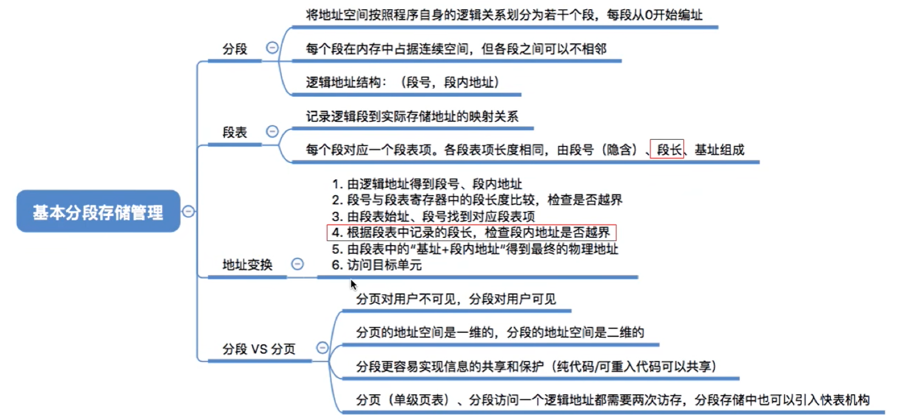

# 内存
 
 - 逻辑地址（相对地址）
 - 物理地址（绝对地址）  
  

 

 

 ## 非连续分配管理  
 把**固定分区分配**改造为**非连续分配版本**  
 基本分页存储管理的思想:  
 把内存分为一个个相等的小分区，再按照分区大小把进程拆分为一个个小部分。

 ### 分页存储管理的基本基本概念
 
 

 ### 基本地址变换机构
 

  ### 具有快表的地址变换机构

  内存中的页表称为慢表  
  寄存器中的页表称为快表
   

 ### 两级页表
    两级页表：多了一个页目录表，就是页表的页表。   
    解决了所有页表项必须连续存放，需要很大连续空间的问题。
    

### 基本分段存储管理
    将地址空间按照程序自身逻辑关系划分为若干个段，每段长度/大小不等。
    分页：按物理单位划分，页是信息的物理单位  每页大小相同
    分段：按程序逻辑划分，段是信息的逻辑单位  每段大小不等
   

### 段页式管理方式 
    先分段，再分页

