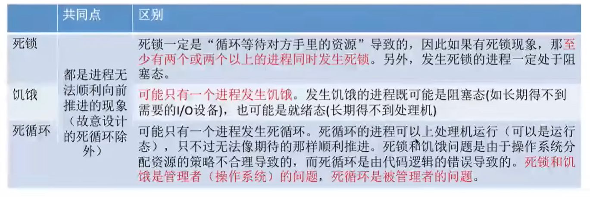
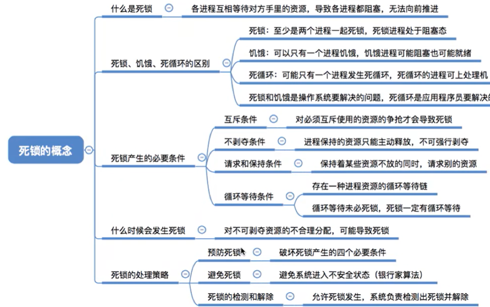
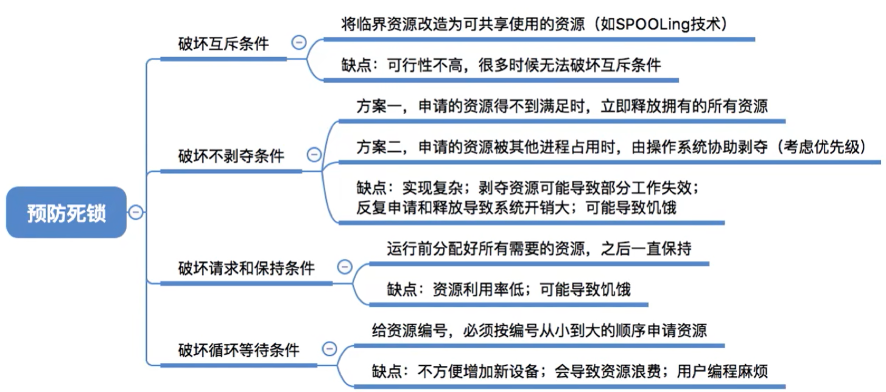
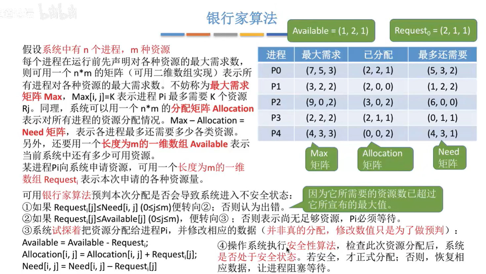
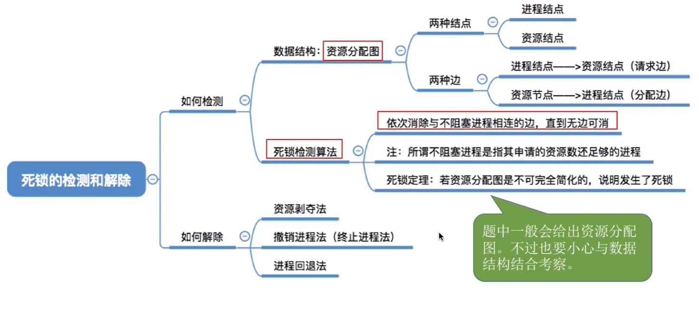

# 死锁

##  1 概念
### 1.1 死锁的概念
死锁：各进程互相等待对方手里的资源，导致各进程都阻塞，无法向前推进的现象。  

### 1.2 死锁产生的必要条件
1. 互斥条件  
2. 不剥夺条件  
3. 请求和保持条件  
4. 循环等待条件     
循环等待条件是死锁的必要不充分条件 

### 1.3 死锁的处理策略
1. 预防死锁。破坏死锁产生的四个必要条件。
2. 避免死锁。用某种方法(银行家算法)防止系统进入不安全状态,从而避免死锁。
3. 死锁的检测与解除。允许死锁的发生，不过操作系统会检测出死锁的发生，然后采取某种措施接触死锁。

### 1.4 概念总结

## 2 预防死锁
 策略或多或少都存在缺陷
 

## 3 避免死锁
安全序列  
安全性算法

### 银行家算法
 

 ## 死锁检测与恢复
 